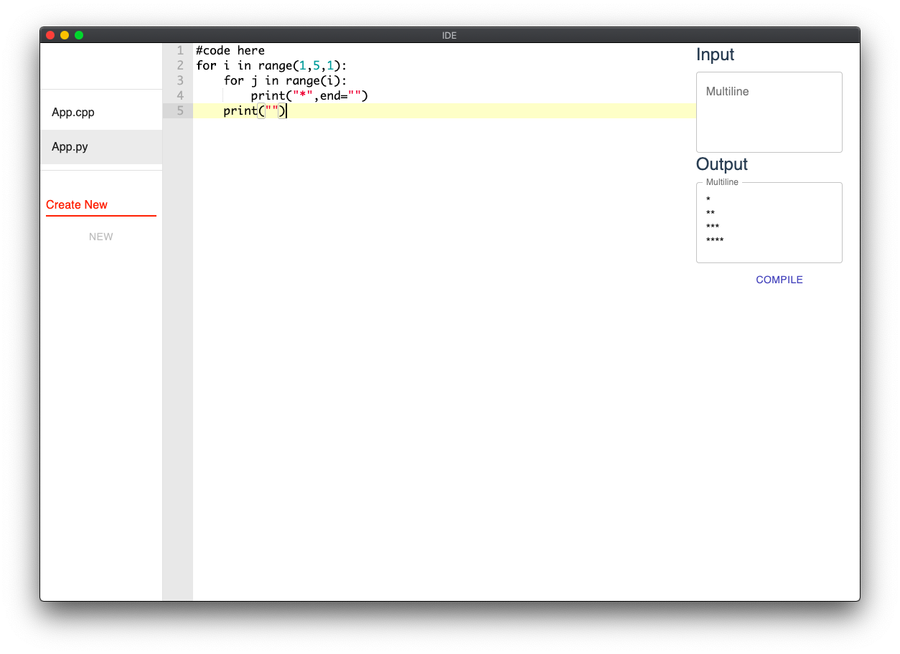

# Desktop IDE

[](https://github.com/anishagg17/Ide_desktop)
[](https://github.com/anishagg17/Ide_desktop)
[](https://github.com/anishagg17/Ide_desktop)
[](https://github.com/anishagg17/Ide_desktop)
[](https://github.com/anishagg17/Ide_desktop)
[](https://github.com/anishagg17/Ide_desktop)
[](https://github.com/anishagg17/Ide_desktop)

This is an IDE built using [Electron](http://electron.atom.io/), ReactJs, NodeJs, Webpack, TypeScript, JavaScript.



## Installation

1. Install [Node.js](https://nodejs.org/)
2. `npm install`

## Development

### Watch & Launch application

Run the watch files, background complie JavaScript/TypeScript/CSS and Launch the Electron app 

```bash
npm start
```

## Release build

Build the app for production. Please build individually because there is a platform-specific processing.

```bash
npm run release:mac
npm run release:win
npm run release:linux
```

or

```bash
npm run release:build
npm run release:pack-mac
npm run release:pack-win
npm run release:pack-linux
```

It is also will be skipped by running the `release:mac` or `release:pack-mac` in the Windows environment.
